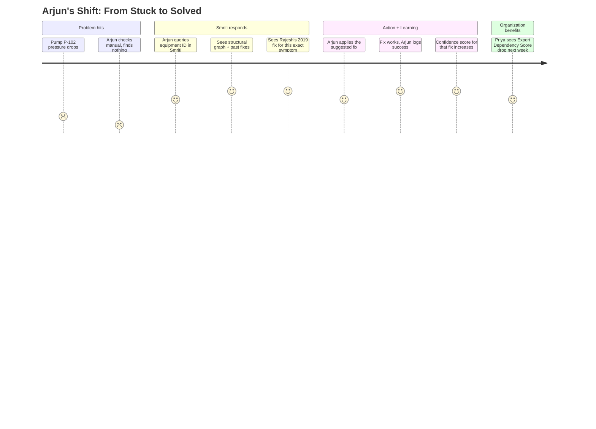
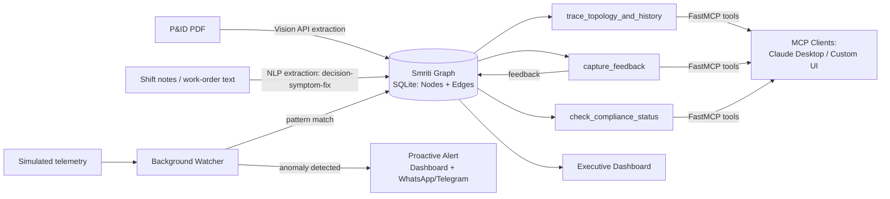

# Product Requirements Document
## Smriti — The Industrial Memory OS
**Prepared for:** ET AI Hackathon 2026 (2nd edition) | **Version:** 1.0 | **Status:** Build-ready

---

## 1. Executive Summary

Smriti is an Industrial Memory Operating System that fuses a plant's physical topology (P&IDs, equipment relationships) with its experiential knowledge (shift notes, work-order comments, technician judgment) into a single, self-learning graph. Unlike incumbent EAM/CMMS platforms, which treat free-text operator input as an unstructured attachment, Smriti extracts it into structured **decision → symptom → fix** relationships, exposes them through a lightweight FastMCP tool mesh, and reinforces or decays confidence in each fix based on real technician feedback. The result is a system that answers a field technician's question with both the plant's structural context *and* the tribal knowledge of the people who've solved that exact problem before — and that gets measurably better with every shift.

This PRD defines a scoped, defensible MVP buildable within a hackathon build window, and a credible path from that MVP to a fundable product.

---

## 2. Problem Statement

Asset-intensive plants run on two kinds of knowledge: what's written down (P&IDs, manuals, work orders) and what's known but never recorded (why an experienced operator makes a specific judgment call under specific conditions). Systems of record like IBM Maximo and SAP PM excel at the first kind and structurally ignore the second. When experienced staff retire or rotate out, the second kind of knowledge — often the more operationally decisive kind — leaves with them, and every future technician re-solves the same problem from scratch. A generic RAG chatbot bolted onto the manual doesn't close this gap; it can only retrieve what was already written, so it confidently returns the *wrong* answer for exactly the edge cases where tribal knowledge diverges from the official procedure.

**Verified scale of the problem:**
- Global 500 companies lose an estimated $1.4 trillion annually to unplanned downtime — 11% of revenue (Siemens, *True Cost of Downtime*, 2024)
- Automotive-sector downtime costs ~$2.3M/hour (Siemens, 2024)
- Knowledge workers lose ~20% of the workweek to searching for information rather than using it (McKinsey Global Institute)

*(Full stat audit, including which figures from earlier drafts were dropped as unverifiable, is in the companion Product Strategy document, Section 3.)*

---

## 3. Objectives

1. Prove that structural and experiential plant data can be fused into a single queryable graph within a hackathon build window.
2. Demonstrate a visibly self-learning system — one where a technician's correction measurably changes future system behavior, live, on stage.
3. Demonstrate genuine technical differentiation via a native FastMCP tool mesh, not a bolted-on chatbot UI.
4. Deliver a business-facing view (the Executive Dashboard) that converts an abstract risk into a trackable metric a real plant manager would recognize.
5. Win on all five official judging dimensions: **Relevance, Technical Implementation, Business Viability, Innovation, Presentation.**

---

## 4. Business Goals

| Goal | Metric |
|---|---|
| Win / place at ET AI Hackathon 2026 | Finalist selection → top-3 placement |
| Secure a pilot design partner post-hackathon | 1 signed LOI with a mid-sized plant within 3 months |
| Prove the self-learning claim with real data | ≥50 real technician feedback events logged in pilot |
| Build toward Seed-stage fundability | A working demo + 1 pilot + a defensible data-moat narrative by month 6 |

---

## 5. Success Metrics

See Product Strategy doc Section 11 for the full breakdown. Headline metrics carried into engineering acceptance criteria (Section 15):
- 100% of the 5 MVP features demoable end-to-end without a mocked screen
- ≥1 unprompted system action during the live demo (the proactive alert)
- Feedback-loop latency: technician correction → visible confidence-score change, in under 3 seconds

---

## 6. Target Users

Field Technician · Maintenance Engineer · Plant Manager · Safety Officer · Reliability Engineer · Operations Head · Compliance Officer.

---

## 7. Personas

### 7.1 Arjun — Field Technician
- **Age/experience:** 26, 4 years on the floor
- **Goal:** Fix the problem in front of him fast, without waiting on a senior colleague who might be on another shift
- **Currently uses:** Paper logs, WhatsApp groups, memory of what a senior colleague once told him
- **Quote:** *"I know someone's fixed this exact pump before. I just don't know who, or how."*

### 7.2 Meera — Maintenance Engineer
- **Age/experience:** 34, plans and executes preventive/corrective maintenance
- **Goal:** Diagnose root cause fast and correctly the first time, not the third time
- **Currently uses:** EAM work-order history, spreadsheets, tribal memory of the team
- **Quote:** *"Half my job is remembering things nobody wrote down."*

### 7.3 Rajesh — the Retiring Senior Engineer (narrative anchor, not a primary daily user)
- **Age/experience:** 58, 32 years at the same facility
- **Goal (in the demo narrative):** Wants his judgment to outlive his tenure
- **Role in the product:** The person whose tribal knowledge Smriti is built to capture before it's lost

### 7.4 Priya — Plant Manager
- **Age/experience:** 41, oversees the full facility
- **Goal:** Minimize unplanned downtime and know where operational risk is concentrated
- **Currently uses:** Dashboards from EAM/ERP that show *what* happened, never *why it was avoidable*
- **Quote:** *"I can see downtime after it happens. I want to see the risk before it does."*

### 7.5 Suresh — Safety Officer
- **Age/experience:** 45, responsible for PESO/OISD-aligned procedures
- **Goal:** Ensure safety-critical tribal knowledge isn't concentrated in one or two people
- **Currently uses:** Manual audits, incident post-mortems
- **Quote:** *"We usually find out someone 'just knew' about a hazard right after it causes a problem."*

### 7.6 Kavita — Reliability Engineer
- **Age/experience:** 37, builds failure-pattern and predictive-maintenance models
- **Goal:** Structured failure data at scale, not scattered PDFs
- **Currently uses:** Manually compiled spreadsheets pulled from multiple systems
- **Quote:** *"I spend more time cleaning data than modeling it."*

### 7.7 Ananya — Operations Head
- **Age/experience:** 48, owns cross-shift consistency and overall plant performance
- **Goal:** The night shift should act on the same knowledge the day shift does
- **Currently uses:** Shift-handover meetings, informal notes
- **Quote:** *"Every shift change is a small knowledge-loss event. We just don't measure it."*

---

## 8. User Stories

- As a **field technician**, I want to query an asset by ID and see both its structural connections and any past fixes for similar symptoms, so I can resolve issues without waiting for a senior colleague.
- As a **maintenance engineer**, I want to submit feedback on whether a suggested fix worked, so the system gets more accurate for the next person who hits the same problem.
- As a **plant manager**, I want a single dashboard showing how much operational knowledge is captured versus still undocumented, so I can quantify and act on institutional risk.
- As a **safety officer**, I want compliance-relevant decision traces flagged automatically, so safety-critical tribal knowledge isn't only known by one person.
- As a **reliability engineer**, I want structured decision-symptom-fix data exportable for pattern analysis, so I can feed it into predictive models without manual cleanup.
- As an **operations head**, I want the same memory graph accessible to every shift, so knowledge transfer doesn't depend on who happens to be on duty.
- As a **developer/integrator**, I want the plant memory graph exposed as MCP tools, so I can connect it to Claude Desktop or any MCP-compliant client without building a custom UI.

---

## 9. Use Cases

**UC-1: Query equipment history and tribal knowledge**
Actor: Field Technician → System: `trace_topology_and_history(equipment_id)` → Returns structural connections + ranked, confidence-scored past fixes.

**UC-2: Submit fix feedback**
Actor: Maintenance Engineer → System: `capture_feedback(equipment_id, applied_fix, success)` → Graph confidence score updates; new decision trace logged if the fix was novel.

**UC-3: Receive a proactive alert**
Actor: System (background watcher) → Detects telemetry pattern matching a historical failure → Pushes alert to in-app dashboard + WhatsApp/Telegram webhook → Operator acknowledges or escalates.

**UC-4: Review institutional knowledge health**
Actor: Plant Manager → Views Executive Dashboard → Sees Institutional Context Retained %, Expert Dependency Score, compliance-flag count.

**UC-5: Check compliance status**
Actor: Safety/Compliance Officer → System: `check_compliance_status(equipment_id or procedure_id)` → Returns flagged decision traces relevant to PESO/OISD-aligned procedures.

**UC-6: Drive the system from an external MCP client**
Actor: Developer/Integrator → Connects Claude Desktop (or any MCP client) to the FastMCP server → Calls the same 3 tools without any custom UI.

---

## 10. User Journey (demo walkthrough)

---

## 11. Core Workflow

---

## 12. Functional Requirements

| ID | Requirement |
|---|---|
| FR-1 | System shall parse an uploaded P&ID (PDF/image) via a hosted multimodal API and extract equipment nodes + structural (flow/connection) edges |
| FR-2 | System shall parse unstructured shift-note/work-order text and extract decision–symptom–fix triples as experiential edges |
| FR-3 | System shall store all nodes/edges in a queryable graph (SQLite Nodes/Edges tables with recursive CTE traversal) |
| FR-4 | System shall expose `trace_topology_and_history(equipment_id)` returning both structural neighbors and ranked historical fixes |
| FR-5 | System shall expose `capture_feedback(equipment_id, applied_fix, success)` and update the corresponding edge's confidence score accordingly |
| FR-6 | System shall run a background watcher comparing simulated telemetry against known failure patterns in the graph |
| FR-7 | On pattern match, system shall trigger an alert to both the in-app dashboard and an external webhook (WhatsApp/Telegram) |
| FR-8 | System shall expose `check_compliance_status()` returning decision traces flagged as safety/compliance-relevant |
| FR-9 | System shall render an Executive Dashboard showing Institutional Context Retained %, Expert Dependency Score, and compliance-flag count, computed from live graph data |
| FR-10 | All three MCP tools shall be independently callable from an external MCP client (e.g., Claude Desktop) with no custom UI required |

---

## 13. Non-Functional Requirements

| Category | Requirement |
|---|---|
| Performance | Graph traversal queries return in <500ms at demo scale (hundreds–low thousands of nodes) |
| Reliability | Demo-critical paths (ingestion → query → feedback → alert) must degrade gracefully — no unhandled exceptions visible on stage |
| Usability | Dashboard and query UI must be operable by someone who has never seen the tool before, without a walkthrough |
| Portability | Entire backend must run from a single machine with no external infra dependency beyond the vision/NLP API and the alert webhook |
| Auditability | Every graph mutation (new edge, confidence-score change) must be traceable to its triggering event |
| **Honest scale caveat** | SQLite + CTE traversal is validated only at hackathon/demo scale. Production scale (tens of thousands of documents, real-time SCADA) requires the graph-store migration explicitly planned for the 1-Year roadmap — do not claim current-architecture performance at enterprise scale |

---

## 14. Feature Prioritization (MoSCoW)

| Priority | Feature |
|---|---|
| **Must** | Industrial Memory Graph (fusion ingestion) |
| **Must** | Self-Learning Feedback Loop |
| **Must** | Proactive Alert Copilot (webhook-based) |
| **Must** | FastMCP Tool Mesh (3 tools) |
| **Must** | Executive Knowledge Health Dashboard (single-plant) |
| Should | Compliance-flag tagging (PESO/OISD-aligned) refinements |
| Could | Multi-P&ID ingestion in one session |
| Could | Exportable failure-pattern dataset for reliability engineers |
| Won't (this cycle) | Federated cross-plant network effect |
| Won't (this cycle) | Native mobile app / push notifications |
| Won't (this cycle) | Live third-party EAM/SCADA integration |

---

## 15. MVP Definition & Acceptance Criteria

| Feature | Acceptance Criteria (Given/When/Then) |
|---|---|
| Industrial Memory Graph | **Given** a pre-tested P&ID and a shift-note text file, **when** both are ingested, **then** the graph contains both structural and experiential edges, queryable via `trace_topology_and_history` |
| Feedback Loop | **Given** an existing fix suggestion, **when** a technician marks it as failed and submits an alternative, **then** the original edge's confidence score decreases and a new edge is created within 3 seconds, visible in the UI |
| Proactive Alert | **Given** simulated telemetry matching a known historical failure pattern, **when** the watcher detects the match, **then** an alert appears on the dashboard **and** is delivered via the configured webhook within 10 seconds |
| FastMCP Mesh | **Given** an MCP-compliant client (e.g., Claude Desktop) connected to the FastMCP server, **when** any of the 3 tools is invoked, **then** it returns correctly structured data without requiring the custom UI |
| Executive Dashboard | **Given** live graph data, **when** the dashboard is loaded, **then** Institutional Context Retained %, Expert Dependency Score, and compliance-flag count are computed from real (not hardcoded) data |

---

## 16. Future Scope

See Product Strategy doc Section 10 for full roadmap. PRD-relevant deferred items:
- Migration from SQLite to a scaled graph store (Neo4j / PostgreSQL graph extension) at Series A-track scale
- Real EAM/SCADA API integrations (6-month horizon)
- Federated, opt-in, anonymized cross-plant pattern sharing (1-year horizon, requires ≥2 real plants and legal data-sharing agreements — explicitly not a hackathon deliverable)
- Native mobile application

---

## 17. System Constraints

- Single-machine, hackathon-duration build — no assumption of persistent cloud infrastructure beyond the vision/NLP API calls and the alert webhook
- Demo dataset is simulated/pre-selected, not live plant data — must be disclosed honestly if asked, not presented as live production data
- SQLite is a demo-scale choice; do not claim it as the production-scale architecture (see Section 13)

---

## 18. Security Requirements

- Shift notes and work-order text can contain names and informal, sometimes candid operator commentary — treat all ingested free text as **containing PII by default**; do not display raw source text in the public-facing demo without review
- MCP tool endpoints should require basic authentication even in the demo build, to establish the pattern for production (does not need to be production-grade for the hackathon, but should not be fully open)
- Feedback/audit trail (who submitted what correction, when) should be logged from day one — this is both a security and a compliance requirement (see Section 19)

---

## 19. Compliance Requirements

- Frame PESO (Petroleum and Explosives Safety Organisation) and OISD (Oil Industry Safety Directorate) alignment as **demo-level flagging of relevant decision traces**, not as a certified compliance product — do not claim regulatory certification you don't have
- Every safety-relevant decision trace must retain an audit trail: source, timestamp, and confidence history — this is the foundation of the "why," not just "what," value proposition for the Compliance Officer persona

---

## 20. Risk Analysis

See Product Strategy doc Section 12 for the full table (fact-checking risk, live-demo technical risk, overclaiming risk, execution risk). PRD-specific addition:

| Risk | Mitigation |
|---|---|
| Vision API rate limits/latency during live demo | Pre-cache the parsed result for the exact demo P&ID as a fallback; call the API live only if time and connectivity allow |
| Webhook delivery delay during live demo (network dependency) | Test on venue Wi-Fi beforehand if possible; keep the in-app dashboard alert as the non-negotiable fallback path |
| Judges probe the "confidence score" math | Be ready to explain it simply and honestly: it's a bounded reinforcement update (e.g., weighted increment/decrement), not a black box — over-engineering the explanation reads worse than a clear, simple one |

---

## 21. Competitive Analysis

| Player | Strength | Structural weakness Smriti exploits |
|---|---|---|
| IBM Maximo / SAP PM | Deep, mature systems of record for physical assets | Treats free-text operator input as an unstructured attachment, not queryable data |
| Generic RAG-on-manuals chatbots | Fast to stand up, good for retrieving official documentation | No mechanism to capture or reconcile tribal knowledge that diverges from the official manual; hallucinates on edge cases |
| CMMS tools (MaintainX, Fiix, UpKeep-class products) | Good work-order workflow and mobile UX | Not designed to extract structured decision-symptom-fix relationships from free text, and not built around a continuous learning loop |
| In-house Neo4j knowledge-graph projects (enterprise-built) | Real graph power at scale | Slow to stand up — ontological mapping and master-data projects measured in quarters, not days |

---

## 22. Differentiation Strategy

Lead every conversation — investor, judge, or customer — with one sentence: *"We're the only system that fuses what a plant **is** with what a plant **knows**, in one graph, and gets smarter every shift."* Everything else (FastMCP, SQLite, the dashboard) is supporting evidence for that one claim, not the claim itself. Do not lead with the tech stack; lead with the fusion.

---

## 23. Business Model

- **Pilot stage (0–6 months):** Free/low-cost design-partner pilots with 1–2 mid-sized plants, in exchange for real usage data and a case study
- **Seed stage (6–12 months):** Per-facility SaaS licensing, priced on facility size/asset count, with implementation support for EAM integration
- **Scale stage (1–3 years):** Tiered SaaS (single-plant vs. multi-plant/federated tier), with the federated tier priced at a premium once the cross-plant network effect is real and legally structured (data-sharing agreements between plants under the same operator group)

---

## 24. Go-to-Market Strategy

1. Start with **mid-sized private-sector plants** (textile, process manufacturing) rather than large PSUs — faster procurement cycles, lower integration complexity, more willing to pilot unproven tools
2. Use the hackathon placement itself as the opening credibility signal for outbound conversations with plant operators
3. Lead pilot conversations with the **Executive Dashboard's Expert Dependency Score** — it's the single artifact that makes an abstract risk concrete enough for a plant manager to act on in one meeting
4. Expand within an operator group (multiple plants under one company) before expanding across unrelated companies — this is also the fastest honest path to a real, legally clean federated network effect

---

## 25. Future Vision

Smriti starts as a single-plant memory graph proving that structural and experiential industrial knowledge can be fused and made to compound. It becomes a real business as that fusion is validated with paying design partners and the decision-trace dataset becomes a genuine, accumulated data asset. At scale, it becomes the connective memory layer for an entire industrial group — and eventually, for Indian heavy industry broadly — closing the knowledge cliff created by a retiring generation of engineers, one verified decision trace at a time.

---

*Companion document: `01_Smriti_Product_Strategy.md` (Phase 1 — Product Definition, name/pitch rationale, verified statistics, MVP scoping rationale, 48-hour build sequencing).*
