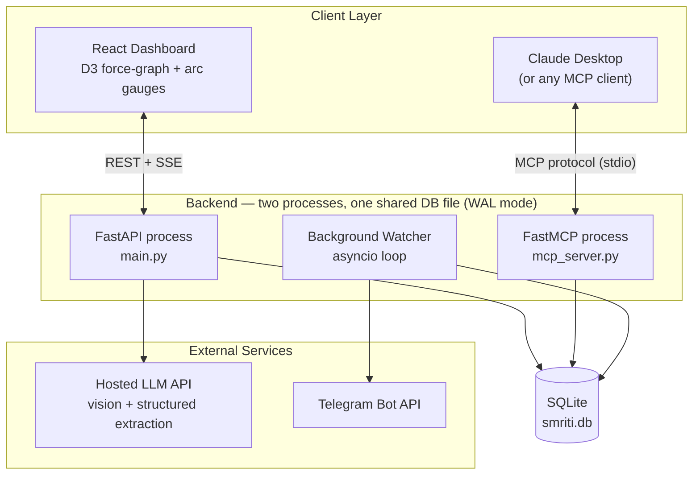
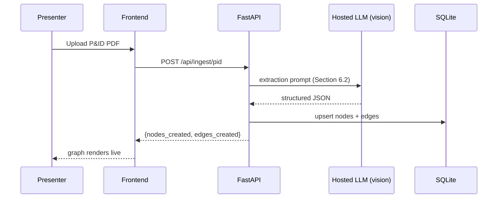
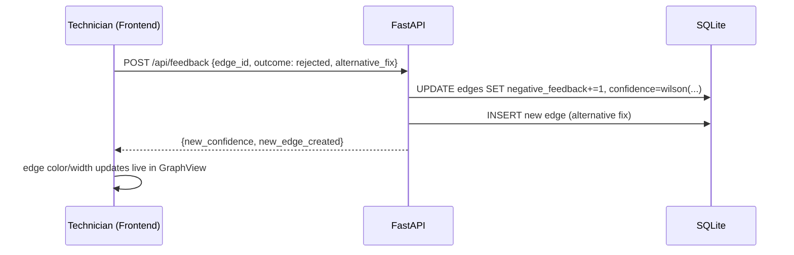
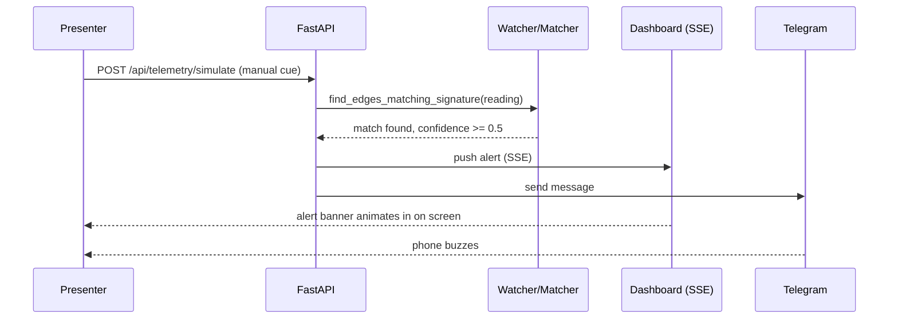

# Engineering Specification
## Smriti — Industrial Memory OS
**Role lens:** Principal Software Architect / AI Systems Engineer | **Version:** 1.0 | **Status:** Code-ready

---

## 0. Architectural Philosophy — what I'm changing from the PRD, and why

The PRD is a good product spec. It is not yet a buildable system — it names *what* (an "NLP pipeline," "the graph," "the confidence score") without committing to *how*. That's the right amount of detail for a PRD and the wrong amount for a team that needs to start typing in the next hour. Here is what I changed, each one a real trade-off, not a restatement:

1. **One extraction method, not two.** The PRD implies a CV pipeline for P&IDs and a separate NLP pipeline for shift notes. I collapsed both into a single pattern: **LLM structured extraction** — a hosted multimodal/text model constrained to a strict JSON schema via prompt + validation. Building or tuning a custom NER/CV stack in a hackathon window would underperform a well-prompted frontier model on both cost and accuracy, and it's genuinely the current best-practice approach, not a shortcut dressed up as one.
2. **Two-node edges, not three-node chains.** Your ontology implies `equipment → symptom → fix`, a 3-hop structure. I collapsed it to `equipment → fix`, with the symptom stored as a rich property *on the edge* rather than as its own node. A symptom has no identity worth reusing across equipment — it's context for one specific historical incident, not an entity. This removes a join from every single query in the system for zero loss of information.
3. **Recursion only where it earns its keep.** `WITH RECURSIVE` is used exclusively for structural topology tracing (the genuinely multi-hop part — "what's connected to what"). Experiential lookups (symptom → fix history) are flat, indexed, single-hop queries. Routing everything through a graph-traversal mental model because the word "graph" is in the product name is exactly the kind of unnecessary complexity to cut.
4. **Wilson score lower bound, not a running average.** A naive average can't tell "1 confirmation out of 1" from "18 out of 20" — it would score them identically. The Wilson lower bound (the same method Reddit uses to rank comments) handles small-sample uncertainty correctly, is ~10 lines of code, and gives you a genuinely satisfying answer when a judge asks "why should I trust this number."
5. **Telegram over WhatsApp for the live alert.** WhatsApp Business Cloud API requires Meta business verification with unpredictable turnaround. A Telegram bot is live in under two minutes via BotFather, with zero approval process. Same "a phone buzzes on stage" wow-moment, a fraction of the setup risk. WhatsApp is documented below as a stretch upgrade only.
6. **Two OS processes, one SQLite file — no message bus.** The FastAPI web server and the FastMCP tool server are separate processes (they have to be — different protocols), but they don't need to talk to *each other*. They both read and write the same `smriti.db` file, with `PRAGMA journal_mode=WAL` enabled so concurrent access doesn't lock. No Redis, no Celery, no queue. That infrastructure exists in your DHOS stack for a reason that doesn't apply here — two local processes and a demo-duration dataset don't need it.
7. **A manual demo trigger, not a purely autonomous watcher.** The "proactive alert" is your single best demo beat. Leaving it entirely to an autonomous background loop means it might not fire in the 90-second window you have for it on stage. The watcher runs autonomously *and* exposes a manual trigger endpoint the presenter can hit on cue. Both are real; only one is guaranteed.
8. **Reuse your HUD rendering patterns.** The graph-bloom visualization and the dashboard's arc-gauge metrics are close cousins of what you already built and debugged in RAPHAEL — canvas/SVG-driven, dark, sci-fi, data-dense. That's not a styling suggestion, it's a build-speed decision: you're not learning a new rendering pattern under a 48-hour clock, you're re-skinning one you already trust.

---

## 1. System Architecture



**Why this shape:** every arrow into `smriti.db` is the actual integration layer of the system. There is deliberately no service-to-service API between the FastAPI process and the FastMCP process — the database *is* the contract between them. This is the single biggest complexity-reduction decision in this spec.

---

## 2. Tech Stack

| Layer | Choice | Why |
|---|---|---|
| Backend language | Python 3.11+ | FastMCP is Python-native; matches your existing DHOS stack |
| REST framework | FastAPI | Async-native, auto-generated OpenAPI docs (useful as a live artifact if a judge asks to see the API), pairs cleanly with FastMCP |
| MCP layer | FastMCP | The explicit hackathon differentiator; current, credible, real "Innovation" signal |
| Database | SQLite, WAL mode | Zero infrastructure, single portable file, sufficient for demo-scale graph queries. **Explicitly not the production architecture** — see PRD Section 13 |
| LLM (extraction + vision) | Hosted API — Gemini or Claude vision | Reuses skills/credentials you already have from DHOS; avoids the GPU/hosting risk of self-hosting Qwen2.5-VL |
| Frontend framework | React + Vite | Fast dev loop, component reuse |
| Graph visualization | D3.js, force-directed layout | Right tool for the "graph blooms on screen" moment |
| Dashboard visuals | Custom arc gauges + dark canvas theme (ported from RAPHAEL) + Tailwind | Reuse a pattern you've already built and debugged, don't build a new one under time pressure |
| Alerts | Telegram Bot API (primary) — WhatsApp Cloud API (stretch, if pre-verified) | See trade-off #5 above |
| Background jobs | Plain `asyncio` loop | No queue infra needed for a single-process, demo-duration watcher |
| Process/state sharing | Shared SQLite file, WAL mode | See trade-off #6 above |

---

## 3. Repository Structure

```
smriti/
├── backend/
│   ├── main.py                    # FastAPI app: REST routes + SSE alert stream
│   ├── mcp_server.py              # FastMCP tool definitions (3 tools)
│   ├── services/
│   │   ├── graph_service.py       # trace(), record_feedback() — shared logic, single source of truth
│   │   ├── ingestion_service.py   # P&ID + shift-note extraction, with cached-fallback
│   │   ├── confidence.py          # wilson_lower_bound()
│   │   ├── watcher.py             # background telemetry-matching loop
│   │   └── alerts.py              # Telegram webhook sender
│   ├── db/
│   │   ├── schema.sql
│   │   └── seed_check_compliance.sql
│   ├── models.py                  # Pydantic request/response schemas
│   ├── config.py                  # env var loading
│   └── requirements.txt
├── frontend/
│   ├── src/
│   │   ├── components/
│   │   │   ├── GraphView.jsx      # D3 force-directed graph
│   │   │   ├── Dashboard.jsx      # arc gauges (ported from RAPHAEL)
│   │   │   ├── AlertBanner.jsx    # SSE-driven live alert
│   │   │   └── QueryPanel.jsx     # equipment lookup UI
│   │   ├── api.js
│   │   └── App.jsx
│   ├── package.json
│   └── vite.config.js
├── data/
│   ├── sample_pid.pdf
│   ├── sample_shift_notes.txt
│   └── cached_extractions/        # pre-baked JSON fallback if the LLM API is flaky mid-demo
│       ├── pid_extraction.json
│       └── shift_notes_extraction.json
├── scripts/
│   ├── reset_demo.py              # wipe + reseed DB for a repeatable, rehearsable demo
│   └── smoke_test.py              # one end-to-end golden-path test
├── .env.example
└── README.md
```

---

## 4. Data Model

```sql
-- db/schema.sql

PRAGMA journal_mode = WAL;  -- required: two processes read/write this file concurrently

CREATE TABLE nodes (
    id          TEXT PRIMARY KEY,
    type        TEXT NOT NULL CHECK(type IN ('equipment','fix','procedure')),
    name        TEXT NOT NULL,
    properties  TEXT NOT NULL DEFAULT '{}',   -- JSON: manufacturer, install_date, location...
    created_at  TIMESTAMP DEFAULT CURRENT_TIMESTAMP
);

CREATE TABLE edges (
    id                     TEXT PRIMARY KEY,
    source_id              TEXT NOT NULL REFERENCES nodes(id),
    target_id              TEXT NOT NULL REFERENCES nodes(id),
    relation_type          TEXT NOT NULL CHECK(relation_type IN ('connects_to','has_known_fix')),

    -- structural edges (relation_type = 'connects_to') use this:
    flow_direction         TEXT CHECK(flow_direction IN ('upstream','downstream') OR flow_direction IS NULL),

    -- experiential edges (relation_type = 'has_known_fix') use these:
    symptom_description    TEXT,
    telemetry_signature    TEXT DEFAULT '{}',   -- JSON: {"metric":"pressure","condition":"drop_pct>15"}
    positive_feedback      INTEGER NOT NULL DEFAULT 1,
    negative_feedback      INTEGER NOT NULL DEFAULT 0,
    confidence             REAL NOT NULL DEFAULT 0.0,  -- recomputed on every feedback write, never trust a stale value
    is_compliance_relevant INTEGER NOT NULL DEFAULT 0, -- 0/1, PESO/OISD-aligned flag

    source_excerpt          TEXT,               -- original text this was extracted from — auditability
    source_type              TEXT CHECK(source_type IN ('pid','shift_note','work_order','feedback')),
    created_at              TIMESTAMP DEFAULT CURRENT_TIMESTAMP,
    updated_at              TIMESTAMP DEFAULT CURRENT_TIMESTAMP
);

CREATE TABLE feedback_log (
    id             INTEGER PRIMARY KEY AUTOINCREMENT,
    edge_id        TEXT NOT NULL REFERENCES edges(id),
    technician_id  TEXT NOT NULL,
    outcome        TEXT NOT NULL CHECK(outcome IN ('confirmed','rejected')),
    note           TEXT,
    timestamp      TIMESTAMP DEFAULT CURRENT_TIMESTAMP
);

CREATE INDEX idx_edges_source   ON edges(source_id);
CREATE INDEX idx_edges_target   ON edges(target_id);
CREATE INDEX idx_edges_relation ON edges(relation_type);
CREATE INDEX idx_feedback_edge  ON feedback_log(edge_id);
```

**Why this schema and not the PRD's implied 3-node chain:** every query the product actually needs — "what's wrong with this equipment and what fixed it before" — is one join away. A symptom node with its own identity would only pay for itself if symptoms needed to be queried or reused independently of a specific equipment+fix pair, which nothing in the product does.

---

## 5. Core Algorithms

### 5.1 Confidence Scoring — Wilson Score Lower Bound

```python
# services/confidence.py
import math

def wilson_lower_bound(positive: int, total: int, z: float = 1.96) -> float:
    """
    Lower bound of the Wilson score confidence interval (z=1.96 -> 95% confidence).
    Why this instead of positive/total: a fix confirmed 1/1 time and one confirmed
    18/20 times should NOT score the same. This is sample-size-aware and conservative
    by construction -- it only trusts a high score once there's enough evidence to earn it.
    """
    if total == 0:
        return 0.0
    z2 = z * z
    phat = positive / total
    denominator = 1 + z2 / total
    centre_adjustment = z2 / (2 * total)
    adjusted_stddev = math.sqrt((phat * (1 - phat) + z2 / (4 * total)) / total)
    lower_bound = (phat + centre_adjustment - z * adjusted_stddev) / denominator
    return max(0.0, round(lower_bound, 4))
```

### 5.2 Structural Traversal — bounded-depth recursive CTE

```sql
-- Trace physically connected equipment up to 3 hops away
WITH RECURSIVE topology(id, depth) AS (
    SELECT :equipment_id, 0
    UNION ALL
    SELECT e.target_id, t.depth + 1
    FROM edges e
    JOIN topology t ON e.source_id = t.id
    WHERE e.relation_type = 'connects_to' AND t.depth < 3
)
SELECT DISTINCT n.id, n.name, n.type, topology.depth
FROM topology
JOIN nodes n ON n.id = topology.id
ORDER BY topology.depth;
```

### 5.3 Experiential Lookup — flat, indexed, no recursion

```sql
-- Ranked historical fixes for this equipment -- one hop, no CTE needed
SELECT e.id, e.symptom_description, f.name AS fix_name, e.confidence,
       e.positive_feedback, e.negative_feedback, e.source_excerpt, e.is_compliance_relevant
FROM edges e
JOIN nodes f ON e.target_id = f.id
WHERE e.source_id = :equipment_id AND e.relation_type = 'has_known_fix'
ORDER BY e.confidence DESC;
```

### 5.4 Telemetry Pattern Matching (background watcher)

```python
# services/watcher.py
import asyncio, json

ALERT_CONFIDENCE_THRESHOLD = 0.5

async def watch_telemetry(poll_interval_seconds: int = 5):
    while True:
        reading = telemetry_simulator.next_reading()
        # reading e.g. {"equipment_id": "P-102", "metric": "pressure", "delta_pct": -18}
        for edge in find_edges_matching_signature(reading):
            if edge["confidence"] >= ALERT_CONFIDENCE_THRESHOLD:
                alert = build_alert(reading, edge)
                await push_to_dashboard(alert)   # SSE
                await send_telegram_alert(alert) # webhook
        await asyncio.sleep(poll_interval_seconds)

def find_edges_matching_signature(reading: dict) -> list[dict]:
    """Rule-based match, deliberately not ML: compare reading against each
    has_known_fix edge's telemetry_signature JSON for this equipment_id."""
    edges = get_edges_for_equipment(reading["equipment_id"])
    matches = []
    for edge in edges:
        sig = json.loads(edge["telemetry_signature"] or "{}")
        if sig.get("metric") == reading["metric"] and _condition_met(sig.get("condition"), reading):
            matches.append(edge)
    return matches
```

**Why rule-based, not ML:** at demo scale, with a handful of seeded failure signatures, a threshold comparison is both correct and instantly explainable to a judge. An ML anomaly detector here would be unverifiable theater — more surface area to fail live, no retrieval benefit.

---

## 6. Extraction Pipeline (LLM-based, single pattern for both modalities)

### 6.1 Shift-note / work-order text extraction

```
SYSTEM PROMPT:
You are an industrial knowledge extraction engine. Given a raw shift-handover
note or work-order comment, extract every distinct equipment-symptom-fix
relationship explicitly mentioned. Do not infer a fix that isn't stated as
having been applied or recommended. Respond ONLY with valid JSON matching
this schema, no prose, no markdown fences:

{
  "extractions": [
    {
      "equipment_name": string,
      "symptom_description": string,
      "fix_description": string,
      "is_compliance_relevant": boolean,
      "source_excerpt": string
    }
  ]
}

If nothing qualifies, return {"extractions": []}.

FEW-SHOT EXAMPLE
Input: "Night shift 14/07 - P-102 pressure kept dipping during monsoon rain
again. Checked upstream valve V-101 first instead of the bearing per the
manual -- it was partially closed from moisture buildup. Cleared it, pressure
stabilized in 10 min. Did NOT need a bearing replacement."

Output:
{
  "extractions": [
    {
      "equipment_name": "Pump P-102",
      "symptom_description": "Pressure dipping intermittently during monsoon/rain",
      "fix_description": "Check and clear upstream Valve V-101 (moisture buildup) instead of bearing replacement",
      "is_compliance_relevant": false,
      "source_excerpt": "Checked upstream valve V-101 first instead of the bearing per the manual -- it was partially closed from moisture buildup. Cleared it, pressure stabilized in 10 min."
    }
  ]
}
```

### 6.2 P&ID vision extraction

```
SYSTEM PROMPT:
You are a P&ID (Piping and Instrumentation Diagram) parsing engine. Given an
image of a P&ID, extract every distinct equipment item and the structural
connections between them. Respond ONLY with valid JSON:

{
  "equipment": [{"id": string, "name": string, "type": string}],
  "connections": [{"source_id": string, "target_id": string, "flow_direction": "upstream"|"downstream"}]
}
```

**Validation rule (apply to both):** reject and retry once if the response fails `json.loads()` or schema validation; on second failure, fall back to the cached extraction in `data/cached_extractions/` (see Section 14). Never let a malformed LLM response reach the demo UI.

---

## 7. Service Layer (shared source of truth)

```python
# services/graph_service.py

def trace(equipment_id: str) -> dict:
    """Powers both the REST endpoint and the trace_topology_and_history MCP tool."""
    return {
        "structural": query_structural_topology(equipment_id),   # 5.2
        "experiential": query_experiential_history(equipment_id) # 5.3
    }

def record_feedback(edge_id: str, technician_id: str, outcome: str,
                     alternative_fix: str | None = None, note: str = "") -> dict:
    edge = get_edge(edge_id)
    if outcome == "confirmed":
        edge["positive_feedback"] += 1
    elif outcome == "rejected":
        edge["negative_feedback"] += 1
    else:
        raise ValueError("outcome must be 'confirmed' or 'rejected'")

    edge["confidence"] = wilson_lower_bound(
        edge["positive_feedback"],
        edge["positive_feedback"] + edge["negative_feedback"]
    )
    save_edge(edge)
    log_feedback(edge_id, technician_id, outcome, note)

    result = {"edge_id": edge_id, "new_confidence": edge["confidence"]}

    if outcome == "rejected" and alternative_fix:
        new_edge = create_fix_edge(
            equipment_id=edge["source_id"],
            symptom_description=edge["symptom_description"],
            fix_name=alternative_fix,
            source_type="feedback",
        )
        result["new_edge_created"] = new_edge["id"]

    return result

def compliance_check(equipment_id: str) -> dict:
    return {"flagged_edges": query_compliance_flagged_edges(equipment_id)}
```

**Why this file matters most:** `main.py` and `mcp_server.py` should each be a thin wrapper — a few lines that parse a request, call one of these functions, and serialize the response. If business logic ever ends up duplicated between the REST route and the MCP tool, that's the bug to fix first; this file is the only place it should live.

---

## 8. FastMCP Tool Definitions

```python
# mcp_server.py
from fastmcp import FastMCP
from services import graph_service

mcp = FastMCP("smriti")

@mcp.tool
def trace_topology_and_history(equipment_id: str) -> dict:
    """Given an equipment ID, return its physically connected neighbors (up to
    3 hops) and its ranked historical fixes, sorted by confidence."""
    return graph_service.trace(equipment_id)

@mcp.tool
def capture_feedback(edge_id: str, technician_id: str, outcome: str,
                      alternative_fix: str = "", note: str = "") -> dict:
    """Record whether a suggested fix worked. outcome must be 'confirmed' or
    'rejected'. If rejected and alternative_fix is provided, a new decision
    trace is created."""
    return graph_service.record_feedback(
        edge_id, technician_id, outcome, alternative_fix or None, note
    )

@mcp.tool
def check_compliance_status(equipment_id: str) -> dict:
    """Return decision traces for this equipment flagged as safety/compliance-
    relevant (PESO/OISD-aligned)."""
    return graph_service.compliance_check(equipment_id)

if __name__ == "__main__":
    mcp.run()  # stdio transport by default -- see Section 15 for Claude Desktop config
```

---

## 9. REST API Contract

| Method | Path | Request | Response | Notes |
|---|---|---|---|---|
| POST | `/api/ingest/pid` | multipart file | `{nodes_created, edges_created}` | vision extraction → upsert |
| POST | `/api/ingest/shift-notes` | `{text}` | `{extractions[], edges_created}` | text extraction → upsert |
| GET | `/api/equipment/{id}/history` | – | `{structural[], experiential[]}` | mirrors `trace()` |
| POST | `/api/feedback` | `{edge_id, technician_id, outcome, alternative_fix?, note?}` | `{edge_id, new_confidence, new_edge_created?}` | mirrors `record_feedback()` |
| GET | `/api/compliance/{equipment_id}` | – | `{flagged_edges[]}` | mirrors `compliance_check()` |
| GET | `/api/dashboard/metrics` | – | `{context_retained_pct, expert_dependency_score, compliance_flags}` | see Section 10 for formulas |
| GET | `/api/alerts/stream` | – | SSE stream | live feed for `AlertBanner.jsx` |
| POST | `/api/telemetry/simulate` | `{equipment_id, metric, delta_pct}` | `{triggered, alert?}` | **presenter's manual trigger for the demo's proactive-alert beat** |

---

## 10. Executive Dashboard — actual metric formulas

The PRD names these metrics but doesn't define them. Here's the exact, defensible computation for each:

**Institutional Context Retained %**
```sql
SELECT
  100.0 * COUNT(DISTINCT CASE WHEN e.confidence >= 0.5 THEN e.source_id END)
        / COUNT(DISTINCT n.id)
FROM nodes n
LEFT JOIN edges e ON e.source_id = n.id AND e.relation_type = 'has_known_fix'
WHERE n.type = 'equipment';
```
*% of equipment nodes that have at least one fix trace with confidence ≥ 0.5.*

**Expert Dependency Score** (0–100, lower is better — a bus-factor metric)
```sql
SELECT technician_id, COUNT(*) AS confirmations
FROM feedback_log WHERE outcome = 'confirmed'
GROUP BY technician_id ORDER BY confirmations DESC LIMIT 1;
-- score = 100 * (top_technician_confirmations / total_confirmations)
```
*What share of verified knowledge traces back to a single person. High score = high retirement risk concentrated in one individual — exactly the number a plant manager would act on.*

**Compliance Flags**
```sql
SELECT COUNT(*) FROM edges WHERE is_compliance_relevant = 1;
```

---

## 11. Real-Time Alerts

```python
# services/alerts.py
import httpx

async def send_telegram_alert(alert: dict):
    token = config.TELEGRAM_BOT_TOKEN
    chat_id = config.TELEGRAM_CHAT_ID
    text = (f"⚠️ {alert['equipment_id']}: {alert['symptom_description']}\n"
            f"Suggested action: {alert['fix_name']} (confidence {alert['confidence']:.2f})")
    async with httpx.AsyncClient() as client:
        await client.post(
            f"https://api.telegram.org/bot{token}/sendMessage",
            json={"chat_id": chat_id, "text": text},
            timeout=5.0,
        )
```

**Stretch upgrade path (documented, not built by default):** if a pre-verified WhatsApp Business number is available before the hackathon, the same `alerts.py` interface can add a `send_whatsapp_alert()` using the Cloud API — same call shape, swap the HTTP target. Don't attempt first-time Meta business verification during the hackathon itself.

---

## 12. Frontend Architecture

```
App.jsx
├── QueryPanel.jsx        # equipment ID lookup → calls GET /api/equipment/{id}/history
├── GraphView.jsx         # D3 force-directed layout: structural + experiential edges,
│                         #   edge color/thickness driven by `confidence` — this is the
│                         #   "graph blooms" moment, budget real time for this component
├── Dashboard.jsx         # 3 arc gauges (Context Retained %, Expert Dependency, Compliance
│                         #   Flags) -- port the arc-gauge SVG/canvas component from RAPHAEL
│                         #   rather than building a new one
└── AlertBanner.jsx       # subscribes to GET /api/alerts/stream (EventSource), animates
                          #   in on new alert — pair with the Telegram ping for the live beat
```

**Sequence — ingestion:**


**Sequence — feedback (the self-learning moment):**


**Sequence — proactive alert:**


---

## 13. Configuration

```bash
# .env.example
LLM_PROVIDER=gemini              # or claude
LLM_API_KEY=
TELEGRAM_BOT_TOKEN=
TELEGRAM_CHAT_ID=
DATABASE_PATH=./data/smriti.db
ALERT_CONFIDENCE_THRESHOLD=0.5
LLM_TIMEOUT_SECONDS=4            # short timeout -> fall back to cache fast, see Section 14
```

---

## 14. Demo Reliability Engineering

This section exists because "it worked in dev" and "it worked live in front of judges on venue wifi" are different claims, and the gap between them is where hackathon teams lose points that have nothing to do with the idea.

- **Cached-fallback extraction.** `ingestion_service.py` always attempts the live LLM call first with a short (`LLM_TIMEOUT_SECONDS`) timeout. On timeout, error, or malformed JSON, it transparently falls back to the matching pre-baked file in `data/cached_extractions/`. The demo never visibly fails — worst case, it's marginally less "live," and nobody in the audience can tell the difference.
- **`scripts/reset_demo.py`** wipes and reseeds the database from `data/` on every run, so the demo is fully repeatable — rehearse it exactly as many times as you want without state drift.
- **Manual telemetry trigger** (`POST /api/telemetry/simulate`, Section 9) means the proactive-alert beat fires on the presenter's cue, not on a timer's.
- **`scripts/smoke_test.py`** — one end-to-end pytest that runs the full golden path programmatically: ingest → query → submit feedback → assert confidence changed → trigger telemetry → assert alert fired. Run this immediately before walking on stage. One good end-to-end test is worth more than partial unit coverage in a 48-hour window.

**Golden-path rehearsal checklist** (mirrors the 5-minute demo script in the Product Strategy doc):
1. `python scripts/reset_demo.py`
2. Upload the pre-tested P&ID → graph renders
3. Ingest the pre-tested shift-notes file → experiential edges appear
4. Query a specific equipment ID → show structural + experiential results together
5. Hit `POST /api/telemetry/simulate` on cue → alert banner + Telegram ping
6. Submit a "rejected" feedback with an alternative fix → watch confidence update live
7. Switch to the Dashboard → show real, computed metrics
8. (Optional, if time/stability allows) Open Claude Desktop, call one MCP tool live

---

## 15. MCP Client Setup (Claude Desktop)

```json
{
  "mcpServers": {
    "smriti": {
      "command": "python",
      "args": ["backend/mcp_server.py"],
      "env": { "DATABASE_PATH": "./data/smriti.db" }
    }
  }
}
```
Add this to Claude Desktop's config, restart, and all 3 tools become callable from the client with zero additional UI work — this is the literal proof of the "Universal Integration Mesh" claim, so demo it live if the room and time allow rather than only describing it.

---

## 16. Testing Strategy

Not full TDD — one smoke test that exercises the real golden path (Section 14) is the correct level of investment for this timeframe. Add unit tests only for `wilson_lower_bound()` (pure function, easy, and worth it since it's the number most likely to be questioned) and the JSON-schema validators for the extraction responses (cheap insurance against a malformed LLM response reaching the UI).

---

## 17. 48-Hour Build Plan (file-level)

| Hours | Milestone | Artifacts done |
|---|---|---|
| 0–2 | Schema + repo scaffold | `db/schema.sql`, folder structure, `.env.example` |
| 2–6 | Sample data + prompts finalized in isolation | `data/sample_pid.pdf`, `data/sample_shift_notes.txt`, prompts tested standalone before touching the API |
| 6–14 | Core service layer, tested against sample data via script (no API/UI yet) | `services/graph_service.py`, `ingestion_service.py`, `confidence.py` |
| 14–18 | REST layer wired to services | `main.py`, callable via curl/Postman |
| 18–22 | MCP tool server, verified inside Claude Desktop | `mcp_server.py` + working config |
| 22–30 | Watcher + Telegram alerts | `watcher.py`, `alerts.py` |
| 30–40 | Frontend: GraphView, Dashboard (ported arc gauges), QueryPanel, AlertBanner | `frontend/` wired to REST + SSE |
| 40–44 | Reliability layer | `scripts/reset_demo.py`, cached-fallback wiring, `smoke_test.py` |
| 44–46 | Feature freeze — integration only, no new code | — |
| 46–48 | Rehearse the golden path twice, on the actual demo machine and network | — |

---

## 18. Explicit Trade-offs Log

| Decision | Alternative considered | Why rejected |
|---|---|---|
| Single LLM-based structured extraction for both P&ID and shift notes | Custom NER/spaCy + separate CV model | Would consume more of the 48 hours than the rest of the app combined, for a worse result on messy real-world text |
| Two-node edge (`equipment→fix`, symptom as edge property) | Three-node chain (`equipment→symptom→fix`) | Extra hop/join with no retrieval benefit — nothing in the product needs symptoms to have independent identity |
| Wilson score lower bound | Naive running average of confirm/reject | Can't distinguish small-sample luck from earned trust; Wilson score can, and is easy to defend under questioning |
| Telegram Bot API | WhatsApp Business Cloud API | Meta business verification has unpredictable turnaround; Telegram is live in <2 minutes |
| Shared SQLite file (WAL) between two processes | Redis/Celery message queue | No queue is needed for two local processes and a demo-duration dataset |
| Recursive CTE only for structural traversal | Recursive traversal for every query | Experiential lookups are naturally one hop; recursion there adds risk, not value |
| Manual `/api/telemetry/simulate` trigger alongside the autonomous watcher | Fully autonomous watcher only | The proactive-alert beat has to land inside a 5-minute pitch window — autonomous-only risks it not firing on cue |
| Reuse RAPHAEL's canvas/arc-gauge rendering patterns | Build new dashboard visuals from scratch | Re-skinning a pattern you've already debugged is faster and lower-risk than building a new one under a 48-hour clock |

---

*Companion documents: `01_Smriti_Product_Strategy.md` (naming, pitch, MVP scoping rationale) and `02_Smriti_PRD.md` (product requirements, personas, business case). This spec is the build layer beneath both.*
